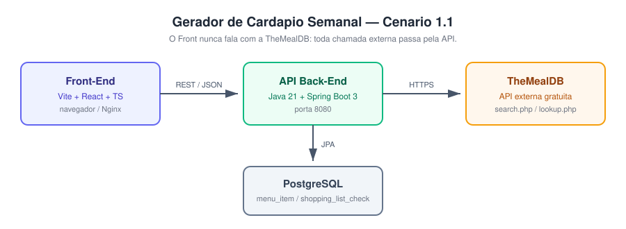

# Cardápio Semanal — Front-End

Interface web para planejar o cardápio da semana (7 dias × 3 refeições) e gerar automaticamente a lista de compras consolidada da semana.

Este é o componente **principal** do Cenário 1.1: ele consome **apenas** a API Back-End própria e nunca chama a TheMealDB diretamente.

- Repositório da API Back-End: <https://github.com/hmartiins/mvp-puc-rio-arq-software-backend>

## Arquitetura



```
Front-End (Vite + React) ──REST──> API Back-End ──HTTPS──> TheMealDB
```

## Stack

- Vite + React 19 + TypeScript
- React Router (rotas client-side)
- Tailwind CSS v4
- `fetch` encapsulado em um client centralizado (`src/lib/api.ts`)
- Docker (build com Vite, serve estático com Nginx)

## Telas

| Rota | Tela | O que faz |
|---|---|---|
| `/` | Cardápio da semana | Grid 7 dias × 3 refeições, com adicionar/editar/remover e **arrastar receitas entre células** |
| `/buscar` | Buscar receitas | Busca por nome e adiciona ao cardápio escolhendo dia, refeição e porções |
| `/lista-de-compras` | Lista de compras | Ingredientes consolidados da semana, com filtro, checkbox e barra de progresso |

O seletor de semana fica no cabeçalho e é compartilhado pelas três telas.

## Como executar

### Local

```bash
npm install
cp .env.example .env      # ajuste VITE_API_URL se necessário
npm run dev
```

Aplicação em <http://localhost:5173>. É preciso ter a **API Back-End rodando** (por padrão em `http://localhost:8080`).

Outros comandos:

```bash
npm run build     # typecheck + build de produção em dist/
npm run preview   # serve o build de produção
npm run lint
```

### Docker (só o Front)

```bash
docker build --build-arg VITE_API_URL=http://localhost:8080 -t cardapio-semanal-front .
docker run -p 8081:80 cardapio-semanal-front
```

Aplicação em <http://localhost:8081>.

### Docker Compose (Front + API + PostgreSQL)

O `docker-compose.yml` na raiz deste repositório sobe o sistema inteiro. Ele constrói a API a partir do repositório vizinho, então clone os dois lado a lado:

```bash
git clone https://github.com/hmartiins/mvp-puc-rio-arq-software-frontend
git clone https://github.com/hmartiins/mvp-puc-rio-arq-software-backend
cd mvp-puc-rio-arq-software-backend
docker compose up --build
```

| Serviço | URL |
|---|---|
| Front | <http://localhost:8081> |
| API | <http://localhost:8080> (Swagger em `/swagger-ui.html`) |
| PostgreSQL | `localhost:5432` (interno ao compose) |

## Variável de ambiente

| Variável | Default | Descrição |
|---|---|---|
| `VITE_API_URL` | `http://localhost:8080` | URL base da API Back-End |

`VITE_API_URL` é lida em **build time** pelo Vite (`import.meta.env.VITE_API_URL`). Para trocar a URL da API sem editar código, passe `--build-arg VITE_API_URL=...` no `docker build` (é o que o `docker-compose.yml` faz) ou defina a variável em um `.env` antes de `npm run build`.

## Chamadas consumidas da API Back-End

Todas centralizadas em `src/lib/api.ts`:

| Método | Rota | Usada em |
|---|---|---|
| GET | `/meals/search?q=` | `/buscar` |
| POST | `/menu-items` | `/buscar` → adicionar ao cardápio |
| GET | `/menu-items?week=` | `/` |
| PUT | `/menu-items/{id}` | `/` → editar item e arrastar entre células |
| DELETE | `/menu-items/{id}` | `/` → remover item |
| GET | `/shopping-list?week=` | `/lista-de-compras` |
| PATCH | `/shopping-list/{ingredient}/check?week=` | `/lista-de-compras` → marcar comprado |

Nenhuma chamada é feita à TheMealDB a partir do navegador.

## Diferenciais

- **Drag-and-drop** de receitas entre dias e refeições no grid, com atualização otimista (a receita se move na hora; se a API falhar, volta ao lugar e aparece um toast de erro).
- **Barra de progresso** da lista de compras (X de Y itens, em %).
- **Skeletons** de carregamento na busca, no cardápio e na lista.
- **Toasts** de feedback ao adicionar, mover e remover itens.
- Navegação entre semanas no cabeçalho, com atalho para voltar à semana atual.
- Erros da API são exibidos com a mensagem que a própria API devolve, e com botão de "tentar de novo".

## Estrutura

```
src/
├── main.tsx
├── App.tsx                    # rotas (react-router)
├── pages/
│   ├── Cardapio.tsx           # "/"
│   ├── Buscar.tsx             # "/buscar"
│   └── ListaDeCompras.tsx     # "/lista-de-compras"
├── components/
│   ├── Layout.tsx             # cabeçalho, abas e seletor de semana
│   ├── WeekGrid.tsx           # grid 7×3 com drop targets
│   ├── MealCard.tsx
│   ├── SearchBar.tsx
│   ├── RecipeResultCard.tsx
│   ├── ShoppingListItem.tsx
│   ├── AddToMenuModal.tsx
│   └── Skeleton.tsx
├── lib/
│   ├── api.ts                 # client HTTP centralizado
│   ├── week.ts                # semana = segunda-feira (aaaa-MM-dd)
│   ├── weekContext.tsx        # semana compartilhada entre as telas
│   └── toast.tsx
└── types/
    └── index.ts               # MenuItem, ShoppingListItem, MealSearchResult
```
